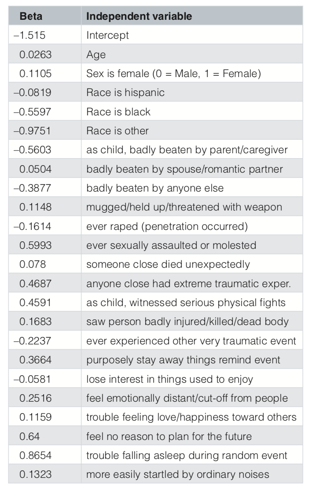

```{r setup, include=FALSE}
knitr::opts_chunk$set(echo = TRUE)
```

\tableofcontents
## Coefficients
Coefficients of the logistic regression model used to impute PTSD outcomes in Kessler et al\footnote{Kessler RC, Duncan GJ, Gennetian LA, et al.: Associations of housing mobility interventions for children in high-poverty neighborhoods with subsequent mental disorders during adolescence. JAMA. 2014; 311(9):
937–948.} 




```{r}
beta<-c(
-1.515  ,#Intercept
0.0263  ,#Age
0.1105  ,#Sex is female (0 = Male, 1 = Female)
-0.0819 ,#Race is hispanic
-0.5597 ,#Race is black
-0.9751 ,#Race is other
-0.5603 ,#as child, badly beaten by parent/caregiver
0.0504  ,#badly beaten by spouse/romantic partner
-0.3877 ,#badly beaten by anyone else
0.1148  ,#mugged/held up/threatened with weapon
-0.1614 ,#ever raped (penetration occurred)
0.5993  ,#ever sexually assaulted or molested
0.078   ,#someone close died unexpectedly
0.4687  ,#anyone close had extreme traumatic exper.
0.4591  ,#as child, witnessed serious physical fights
0.1683  ,#saw person badly injured/killed/dead body
-0.2237 ,#ever experienced other very traumatic event
0.3664  ,#purposely stay away things remind event
-0.0581 ,#lose interest in things used to enjoy
0.2516  ,#feel emotionally distant/cut-off from people
0.1159  ,#trouble feeling love/happiness toward others
0.64    ,#feel no reason to plan for the future
0.8654  ,#trouble falling asleep during random event
0.1323 ) #more easily startled by ordinary noises
```

\newpage

# Play here 

## Modify coefficients: 

```{r}
x<-
c(
1   ,#Intercept
18  ,#Age
1   ,#Sex is female (0 = Male, 1 = Female)
0   ,#Race is hispanic
0   ,#Race is black
1   ,#Race is other
0   ,#as child, badly beaten by parent/caregiver
0   ,#badly beaten by spouse/romantic partner
1   ,#badly beaten by anyone else
1   ,#mugged/held up/threatened with weapon
1   ,#ever raped (penetration occurred)
0   ,#ever sexually assaulted or molested
1   ,#someone close died unexpectedly
1   ,#anyone close had extreme traumatic exper.
1   ,#as child, witnessed serious physical fights
0   ,#saw person badly injured/killed/dead body
0   ,#ever experienced other very traumatic event
1   ,#purposely stay away things remind event
0   ,#lose interest in things used to enjoy
0   ,#feel emotionally distant/cut-off from people
0   ,#trouble feeling love/happiness toward others
0   ,#feel no reason to plan for the future
1   ,#trouble falling asleep during random event
0   )#more easily startled by ordinary noises
```

## Estimate probability of PTSD

```{r}
bx<-x%*%beta
Z<-exp(bx)
p<-Z/(1+Z)
```

The probability of this SIM have PTSD is: `r p`


